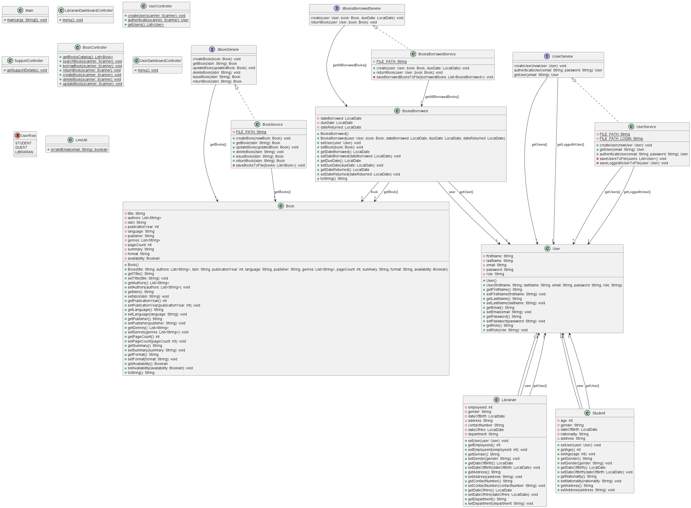

## Library Management System (LMS) - A Java Console Application
### Student Name - Vitalis Ogbonna
### Student Number - A00325718
### Program - MSc Software Design With Cyber Security
### Course Title - Object Oriented Programming 1 
### Course Code - AL_KCNCM_9_1

## Table of Contents
1. [Introduction](#introduction)
2. [Features](#features)
   - [User Roles and Access Levels](#user-roles-and-access-levels)
   - [Functional Requirements](#functional-requirements)
3. [Project Structure](#project-structure)
4. [Setup and Installation](#setup-and-installation)
5. [Usage](#usage)
5. [Default Login Details](#default-users)
6. [Design and Implementation](#design-and-implementation)
7. [Future Enhancements](#future-enhancements)
8. [Author](#author)

---

## Introduction
The **Library Management System (LMS)** is a Java console-based application that enables efficient management of library operations such as book inventory, user account handling, and borrowing/return processes. Designed to cater to various roles like  Librarians, and Students, this application ensures streamlined library workflows with user-friendly features.

---
## UML Diagram




## Features

### User Roles and Access Levels

1. **Librarian**:
   - Manage books (Create, Read, Update, Delete) books.
   - Check book availability.
   - See Library Users.

2. **Student/Library Member**:
   - Register and Login
   - Search books by ISBN.
   - Borrow and return books.
   - View the library catalog.

3. **Guest User**:
   - Search books by title, author, genre, or ISBN.
   - View the library catalog.

---

### Functional Requirements

#### User Roles and Access Levels

1. **Librarian**
   - The system shall allow librarians to create, read, update, and delete book records in the library catalog.
   - The system shall provide functionality for librarians to check the availability status of a book (available, borrowed, reserved).
   - The system shall display a list of all registered library users to the librarian.

2. **Student/Library Member**
   - The system shall enable students/library members to register with their details, including name, email, and password.
   - The system shall allow students/library members to log in with their credentials.
   - The system shall enable students/library members to search for books using their ISBN.
   - The system shall allow students/library members to borrow available books and record the borrowing transaction.
   - The system shall enable students/library members to return borrowed books and update their status in the system.
   - The system shall display the library catalog for students/library members to browse.

3. **Guest User**
   - The system shall allow guest users to search for books by title, author, genre, or ISBN without requiring login or registration.
   - The system shall display the library catalog for guest users to browse without showing additional member-specific details.

---

## Project Structure
```
LibraryManagementSystem/
├── src/
│   ├── lms
│   ├── lms.controllers
│   ├── lms.entities
│   ├── lms.enums
│   ├── lms.interfaces
│   ├── lms.services
│   ├── lms.utils
├── data
├── lib
├── .gitignore         # Git ignore rules
├── README.md          # Project documentation
```

---

## Setup and Installation

### Prerequisites
1. Java Development Kit (JDK) 8 or higher.
2. Eclipse IDE or any Java IDE of your choice.
3. Git for version control.

### Steps
1. Clone the repository:
   ```bash
   git clone https://github.com/agavitalis/vitalis-lms.git
   cd vitalis-lms
   ```
2. Open the project in your Java IDE.
3. Build the project to generate the necessary binaries.
4. Run the `Main.java` file to start the application.

---

## Usage
1. Launch the application.
2. Log in with your role:
   - Admin: Manage books, users, and reports.
   - Librarian: Issue/return books, check availability.
   - Student/Member: Search and borrow books, view history.
   - Guest: Browse the catalog.
3. Follow on-screen instructions for each operation.

---
## Default Users
1. Admin:
   - Email: xxxxx@xxx.com.
   - Password: xxxxxx.
2. Librarian:
   - Email: xxxxx@xxx.com.
   - Password: xxxxxx.
3. Student:
   - Email: xxxxx@xxx.com.
   - Password: xxxxxx.
   

---

## Design and Implementation

### Key Design Principles
- **Separation of Concerns**: Each module handles a specific responsibility.
- **Object-Oriented Design**: Utilizes encapsulation, inheritance, and polymorphism for maintainable and reusable code.
- **User Authentication**: Secure login system with role-based access controls.
- **Error Handling**: Robust exception management to ensure smooth user experience.

### Technologies Used
- **Java**: Core application logic.
- **Eclipse IDE**: Development environment.
- **JUnit**: Unit testing framework.

---

## Future Enhancements
1. Add a graphical user interface (GUI).
2. Integrate with a database for persistent storage.

---

## Author
This project was crafted by Ogbonna Vitalis <a00325718@student.tus.ie>.

---

